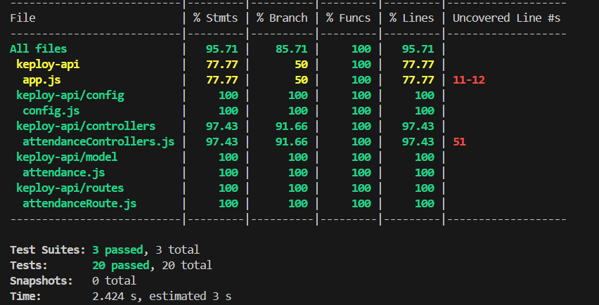

# Attendance API TESTING

This is a Node.js and Express-based API for tracking and managing attendance records, using MongoDB as the database.

It supports full CRUD operations and includes **unit**, **integration**, and **API testing** to ensure robust functionality.

---

## 📦 Tech Stack

- **Backend**: Node.js, Express.js  
- **Database**: MongoDB with Mongoose  
- **Testing**: Jest, Supertest  
- **API Testing**: Postman  
- **Coverage Tool**: Jest Coverage (70%+)

---

## 🚀 Features

- Add, update, and delete attendance records  
- Fetch all attendance entries  
- Robust error handling for missing data and database failures  
- Unit tests for controller logic  
- Integration tests for API routes  
- Manual API testing using Postman

---

## 📂 Folder Structure

```
├── __tests__/
│   ├── integration/                  # Integration tests (Supertest + Jest)
│   │   └── attendanceRoutes.test.js
│   └── unit/                         # Unit tests (Jest)
│       └── attendanceControllers.test.js
```

---

## 🧪 Running Tests

```bash
npm test                # Run unit and integration tests
npm test -- --coverage  # Run tests with coverage report
```

---

## 📬 API Endpoints

- `GET /api/attendance`  
  Fetch all attendance records.

- `POST /api/attendance`  
  Create a new attendance record.  
  **Body**:
  ```json
  {
    "date": "2024-01-01",
    "lectures": 3
  }
  ```

- `PUT /api/attendance/:id`  
  Update a specific attendance record by ID.

- `DELETE /api/attendance/:id`  
  Delete a specific attendance record by ID.

---

## 🔍 API Testing (Postman)

- All routes are verified using **Postman**.  
- You can import a Postman collection or test directly using the above examples.

---

## 🛠️ Tools Used

- **Jest**: For unit and integration testing  
- **Supertest**: For HTTP assertions  
- **Postman**: For manual API testing  
- **MongoDB Memory Server** (optional): For isolated test environments

---

## 📸 Test Coverage

Include a screenshot like this in your repo for reference:  


---
